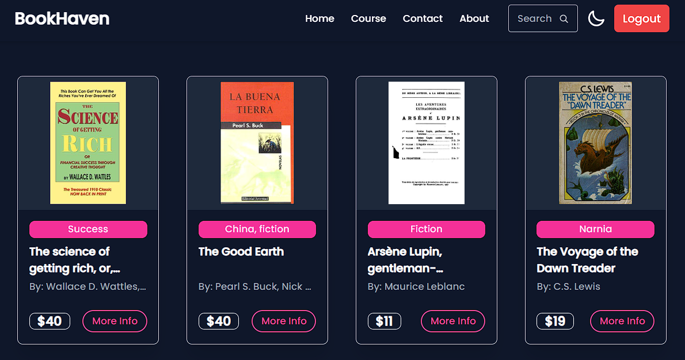

# BookHaven: A Full-Stack Bookstore Application

## Description

BookHaven is a modern and feature-rich online bookstore built with the MERN stack (MongoDB, Express.js, React, Node.js). This application provides a seamless and interactive experience for users to browse, search, and discover a vast collection of books fetched live from the Open Library API. It includes user authentication, protected routes, a dynamic book catalog with search and pagination, and a sleek, responsive design with a dark mode theme switcher.

## Features

- **Dynamic Book Catalog:** Fetches live book data from the Open Library API.
- **User Authentication:** Secure signup and login functionality for users.
- **Protected Routes:** The main "Course" catalog is only accessible to logged-in users.
- **Live Search:** Instantly search for books across the entire catalog.
- **Pagination:** A clean pagination system to easily navigate through search results.
- **Dark/Light Mode:** A theme switcher for a comfortable viewing experience.
- **Responsive Design:** A fully responsive layout that works on all devices, from mobile phones to desktops.
- **Interactive UI:** Detailed book modals and smooth toast notifications for a modern user experience.

## Tech Stack

**Frontend:**
- **React:** A JavaScript library for building user interfaces.
- **Vite:** A fast and modern frontend build tool.
- **React Router:** For client-side routing and navigation.
- **Tailwind CSS & DaisyUI:** For a utility-first approach to styling.
- **Axios:** For making API requests to the backend.
- **React Hook Form:** For efficient and easy form handling.
- **React Hot Toast:** For clean and modern notifications.

**Backend:**
- **Node.js & Express.js:** For building the RESTful API.
- **MongoDB & Mongoose:** As the database for storing user data.
- **CORS:** To handle cross-origin requests between the frontend and backend.
- **bcryptjs:** For hashing user passwords securely.
- **dotenv:** For managing environment variables.

## File Structure

The project is organized into two main folders: `frontend` and `backend`.
  bookstore-app:
    backend:
      - controller/       # Handles the business logic for API routes
      - model/            # Mongoose schemas for database entities
      - route/            # API endpoint definitions
      - index.js          # Main entry point for the backend server
      - package.json      # Backend dependencies and scripts

    frontend:
      src:
        - assets/         # Static assets like images
        - components/     # Reusable UI components
        - context/        # React Context for global state (Auth, Theme)
        - home/           # Components for homepage
        - courses/        # Components for book catalog display
        - pages/          # Standalone pages (About, Contact)
        - App.jsx         # Main React app component with routing
        - main.jsx        # Entry point for React application
      - package.json      # Frontend dependencies and scripts

## Deployment

This application is deployed and live at: **[https://bookstore-app-mu-pink.vercel.app/](https://bookstore-app-mu-pink.vercel.app/)**

The recommended setup for deployment is:
- **Database:** A free cluster on [MongoDB Atlas](https://www.mongodb.com/cloud/atlas).
- **Backend:** Deployed as a Web Service on [Render](https://render.com/).
- **Frontend:** Deployed on [Vercel](https://vercel.com/).

## 👤 Author

**Saad Mohammad Shibli**  
Aspiring Full-Stack Developer passionate about building impactful web applications and exploring emerging technologies.  
📧 saadshibli27@gmail.com  
🔗 [GitHub – saadshibli](https://github.com/saadshibli)  
🏫 Lovely Professional University, Punjab, India

---

## 📄 License

This project is licensed under the [MIT License](https://opensource.org/licenses/MIT).  
© 2025 Saad Mohammad Shibli